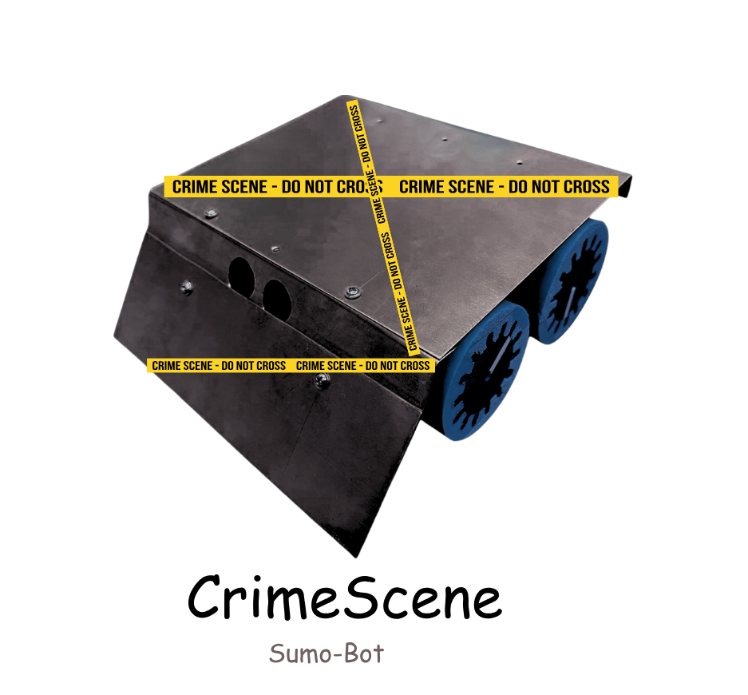

# CrimeScene - KAU Robocon Sumo Bot

  

##  Overview

"CrimeScene" is an autonomous sumo robot vehicle developed for the sumo-robot contest at King Abdulaziz University (KAU) Robocon. This project marked my exciting entry into the world of robotics, and I'm proud to say that my team and I successfully navigated the competition to reach the finals!

The objective of CrimeScene is to autonomously navigate a the sumo ring, detect an opponent robot, and push it out of the arena while ensuring CrimeScene itself remains within the boundaries.

## 🤖 Robot Specifications

| Feature          | Detail                                                                  |
| :--------------- | :---------------------------------------------------------------------- |
| **Chassis Material** | Brass                                                                   |
| **Wheels** | Custom Silicon Wheels (optimized for grip and traction)                 |
| **Microcontroller** | Arduino Leonardo                                                        |
| **Sensing** | Ultrasonic Sensors (for distance detection), Infrared Sensors (for line following/edge detection) |
| **Actuation** | 2 x DC Motors (for propulsion)                                          |
| **Control** | Autonomous                                                              |

  
   
  <em>A peek inside CrimeScene, showcasing the Arduino Leonardo and sensor wiring.</em>

## How It Works

CrimeScene's intelligence is powered by a combination of sensor data fusion and programmed logic:

* **Boundary Detection:** Infrared sensors are strategically placed to detect the white line marking the edge of the sumo ring. When a sensor detects the line, the robot adjusts its movement to stay within the field.
* **Opponent Detection:** Ultrasonic sensors are used to detect the presence and distance of the opponent robot. This information allows CrimeScene to locate and approach the enemy.
* **Offensive Strategy:** Once an opponent is detected, CrimeScene employs programmed pushing strategies to forcefully maneuver the enemy out of the ring. This involves adjusting motor speeds and directions based on sensor feedback.
* **Defensive Maneuvers:** The robot is also programmed with basic defensive maneuvers to avoid being pushed out by the opponent.

## Software

The software for CrimeScene is developed in the Arduino IDE using C++. The code focuses on:
* **Obstacle Detection System** - Uses 6 proximity sensors positioned around the robot (front, middle, rear on both sides) plus ultrasonic and IR sensors

* **Wandering Navigation** - Robot moves forward continuously until obstacles are detected, then executes backup and turn maneuvers

* **Adaptive Speed Control** - Adjusts motor speed based on ultrasonic distance readings (70 PWM when >50cm, 250 PWM when ≤60cm)  

* **Motor Control** - Standard L298N dual motor driver setup with PWM speed control and directional functions
